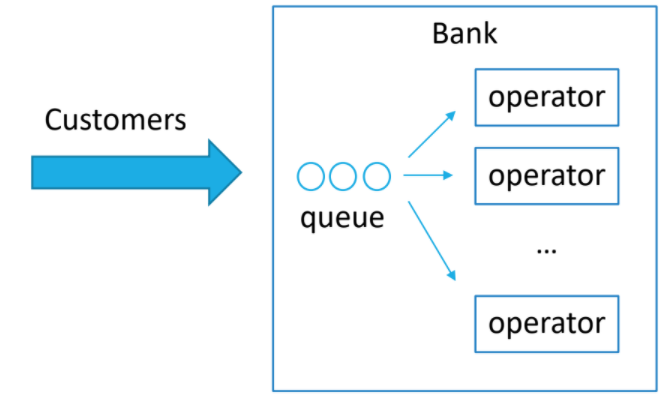
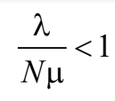
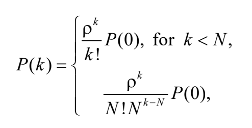
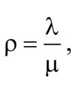
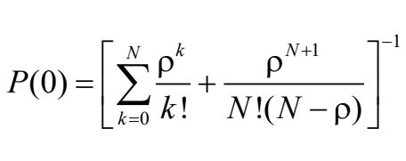
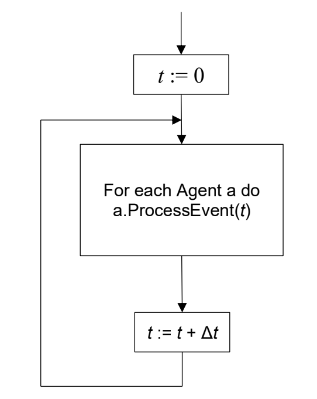
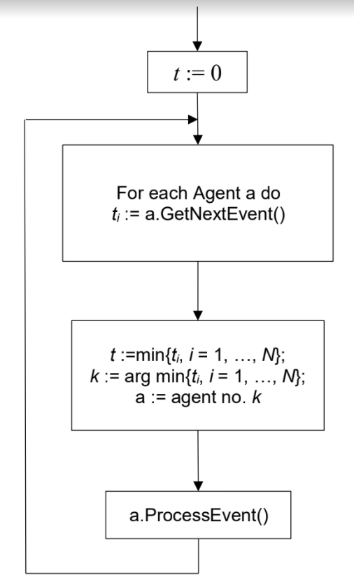
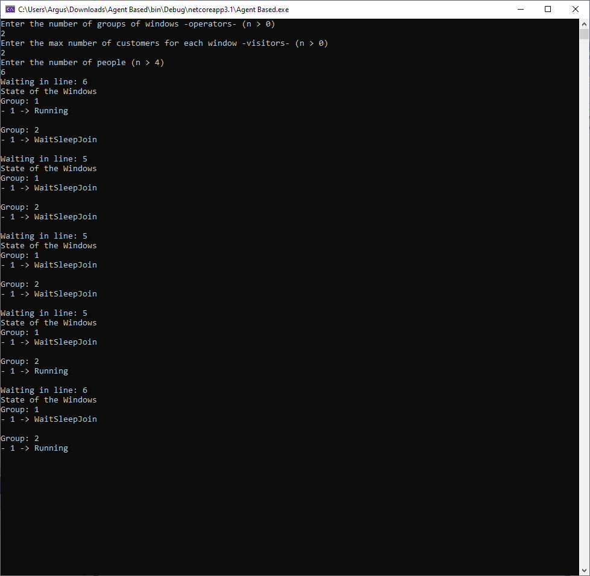

> From July 10, 2020

In the simulation of Markov Chain on continuous time, the main idea is to pick the right time of the simulation in which transitions occur exactly at the moments in which changes on the system happen.

Let's consider the following example.

There are clients going inside the bank, according to the “Stationary Poisson Process” with an intensity `λ`. At the bank there are `N` teller windows (cashier window), so when a client arrives goes straight to the teller if there is no waiting line and there is at least one teller window free.

There would be no limit to the length of the waiting line and the time each client spends with the bank teller (is also the time that the teller window will be busy), this will be a random variable with an exponential distribution parameter `μ`.

This system is a classic example of *queueing systems* and are denominated `QS M/M/N/α` where:

M – Markov — Exponential random variable.

N – Number of bank tellers (teller windows or cashiers).

α – Unlimited number of waiting spots on the queue.



In this case is necessary to generate two random variables.

1. When the client arrives to the bank.
2. When a teller window becomes available

This moments are the base of the model as the simulation will go between them from one event to another.

One thing to consider when building models of a complex system, is to determine all components of the system's state vector. So the resulting chain of state-changes be a Markov process, so
 
> from the component's values in a determined time is possible to calculate the state of the next instant on time.

It is as important to identify everything that may affect the calculations of this points in time when the state of the system changes. In our example the following -what alters the state changes on the system- may happen:

- The time length between the consecutive arrivals to the bank (How often clients arrive?).
- The time spent at teller window (How much time a client spends there?)

The components of this state vector are:
- Number of **busy** teller windows `x ∈ {0, 1, 2, ... , N}`
- Number of **clients** in the waiting line `y ∈ {0, 1, 2, ...}`

## Algorithm
Exponential random variables have one thing in particular, if the interval between the occurrence of two events have an exponential distribution with a parameter `λ`, then on an arbitrary point in time, the remaining time until the next event has a distribution with a parameter `λ` as well.

That's why,
At any moment, the time until a new client arrives to the bank is an exponential random variable with a parameter `λ`.

At any moment, the time until a client arrives at the bank teller is an exponential random variable with a parameter `μ`.

Where:
- x is the number of clients that were served with a bank teller already.
- y is the number of clients that remain waiting at line.

## Description
1. The simulation starts with `t=0, x=0, y=0`

2. The *amount of time* that a client spends at bank teller, which is also the same amount a person at line would have to wait if there are no free teller windows left `t = ExpRV(λ)`

3. If `x > 0`, the amount of time gets simulated to any client with: `δ = ExpRV(μ ∙ λ)`, given that `x` clients were served, the “intensity” of the service will be `μ ∙ x`.

4. If `t < δ` a new client have arrived, then if `x < N` (there are free teller windows and the client is served immediately assuming that there is no line yet) otherwise the client goes to line and waits for a free teller window.

## Statistical Process
The state of this “queueing system” is special due the fact that its values built for the model are included in the *Markov Process*. In our example this is the **number of busy teller windows** and the **number of clients in the line** waiting. On a more complex example other states would be included in the vector, or parameters such as the *time that takes to serve* a client or the *elapsed time* between clients arrival at the bank, etc.

Anyways such a comprehensive analysis usually is not required due that most cases we care more about the individual characteristics of the system, such as:

- The number of busy teller windows.
- The number of clients waiting in line.
- The number of clients in the bank (at teller window and line).

This characteristics are random processes with discrete states likewise on a *Markov chain with continuous time*, so the statistical processing is done in the same way.

For our stationary regime `QS M/M/N/α` the following condition is present:



The stationary distribution of the number of clients in the system is modeled by:



where



and `P(0)` are determined by the following expression:



## Agent based models
This models approach problems from a perspective based on events, where each entity affects the time model and state of the system, this implies different agents and the general process of modeling is made by processing agents events.

## Rules
Each agent is independent, has its own characteristics and  behaviour rules.

Each agent is autonomous  and can independently decide over its actions.

An agent can interact with other agents to obtain information, adjust its behaviour or notify other agents about changes in system state.

Agents should work in an environment in which they can interact with other agents.

This models can be implemented in the following way:

### Constant time
When random factors are not present or don't affect events, is not convenient to use a constant model of time because it will generate errors and an unnecessary overcharge on computing resources.

### Discrete model
A model with discrete events in which the main simulation algorithm is the following:



`ProcessEvent(t)` is a procedure for the agent, that process the event of chain in time model. This way the agent decides if needs to take any action. The algorithm to implement discrete models is the following:



The method `GetNextEvent()` of an agent returns to the system the *point in time* in which an important event **for that agent** happened and is necessary to take action, is assumed that until that point the agent state hasn't changed.

When modeling agents, is ambiguous how agents are selected, so it could be as follows:

- Clients
- Waiting line
- Window tellers
- Clients flow of arrival
- ….

How agents are defined is based on what the developer prefers, or depends on the model itself, and sometimes on how convenient is to implement a proposed model.

## Result



## Implementation

### Teller windows grouping
```csharp
/*
  * We have groups of teller windows, so different types
  * of teller windows handle different transactions
  *
  * For example a client that wants to open an account
  * can only do it on window #1 and so on
  *
 */
 struct GroupThread
 {
     public int ID { get; set; }
     public List threadsList { get; set; }
 }
```
---

### Bank waiting line
```csharp
///
/// Handles the queue of the bank, to let clients go to their respective operator
/// Within the tuple, a new client is enqueued with a type of task and priority
///

public static void ProducerThreadProc()
{
    try
    {
        while (true)
        {
            if (queue.Count < queueSize)
            {
                queue.Enqueue(Tuple.Create(rand.Next(0, groups), rand.Next(), rand.Next()));
            }
            
            Thread.Sleep(4000);
            Thread.Yield();
        }
    }
    catch (ThreadInterruptedException) { return; }
}
```
---

### Bank teller
```csharp
///
/// Here is where the operator work happens
/// From people waiting, we pick the next
/// and check if the free window can do the work
/// So different types of clients can only go
/// to some group of teller windows
///
/// 

public static void ConsumerThreadProc(object data)
{
    var currentData = (GroupThread)data;
    
    try
    {
        while (true)
        {
            if (queue.Count > 0)
            {
                if (mutex.WaitOne())
                {
                    if (queue.TryPeek(out Tuple<int, int, int> m) && m.Item1 == currentData.ID)
                    {
                        if (queue.TryDequeue(out Tuple<int, int, int> n))
                        {
                            mutex.ReleaseMutex();
                            
                            //Constant Time-Step of 5s
                            //Each process takes the same time for simplicity
                            Thread.Sleep(5000);
                        }
                    }
                }
            }
            Thread.Yield();
        }
    }
    catch (ThreadInterruptedException) { return; }
}
```
---

### Main
```csharp
class Program
{
    private static int groups;
    private static int queueSize;
    private static List threads;
    private static Thread producerThread;
    private static Mutex mutex = new Mutex();
    private static Random rand = new Random();
    private static ConcurrentQueue> queue;
    
    [MTAThread]
    public static void Main()
    {
        int consumers;
        Console.CancelKeyPress += new ConsoleCancelEventHandler(Console_CancelKeyPress);
        
        do
        {
            Console.WriteLine("Enter the number of groups of windows -operators- (n > 0)");
            if (Int32.TryParse(Console.ReadLine(), out groups) && groups > 0)
            {
                do
                {
                    Console.WriteLine("Enter the max number of customers for each window -visitors- (n > 0)");

                    if (Int32.TryParse(Console.ReadLine(), out consumers) && consumers > 0)
                    {
                        do
                        {
                            Console.WriteLine("Enter the number of people (n > 4)");
                            if (Int32.TryParse(Console.ReadLine(), out queueSize) && queueSize > 4)
                            {
                                threads = new List<GroupThread>(groups);
                                queue = new ConcurrentQueue<Tuple<int, int, int>>();
             
                                for (int i = 0; i < queueSize; i++)
                                {
                                    queue.Enqueue(Tuple.Create(rand.Next(0, groups), rand.Next(), rand.Next()));
                                }

                                producerThread = new Thread(new ThreadStart(ProducerThreadProc));
                                producerThread.Start();

                                for (int i = 1; i <= groups; i++)
                                {
                                    GroupThread groupThread = new GroupThread
                                    {
                                        ID = i,
                                        threadsList = new List<Thread>(rand.Next(1, consumers))
                                    };
                                    for (int j = 0; j < groupThread.threadsList.Capacity; j++)
                                    {
                                        Thread ct = new Thread(new ParameterizedThreadStart(ConsumerThreadProc));
                                        ct.Start(groupThread);
                                        groupThread.threadsList.Add(ct);
                                    }
                                    threads.Add(groupThread);
                               }

                               //Infinite number of people arrives at the bank.
                               while (true)
                               {
                                   //Current number of people waiting at the bank
                                   Console.WriteLine("Waiting in line: {0}", queue.Count);
          
                                   //Operators attending people on their windows
                                   Console.WriteLine("State of the Windows");

                                   for (int i = 0; i < threads.Count; i++)
                                   {
                                       Console.WriteLine("Group: {0}", i + 1);

                                       for (int j = 1; j <= threads[i].threadsList.Count; j++)
                                       {
                                           Console.WriteLine("- {0} -> {1}", j, threads[i].threadsList[j - 1].ThreadState);
                                       }
                                       Console.WriteLine();
                                  }
         
                                  Thread.Sleep(1000);
                             }
                        }
                        else
                        {
                            queueSize = 0;
                        }
                    } while (queueSize > 4);
                }
                else
                {
                    consumers = 0;
                }
            } while (consumers > 0);
        }
        else
        {
            groups = 0;
        }
    } while (groups > 0);
}
```

[](https://github.com/pablinme/sim-discrete-events)
