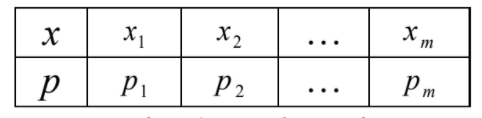
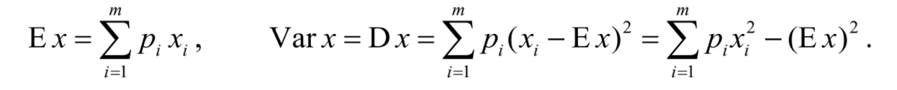
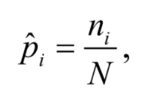
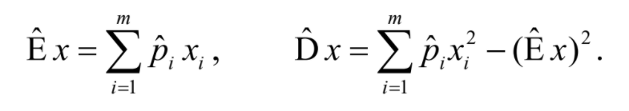
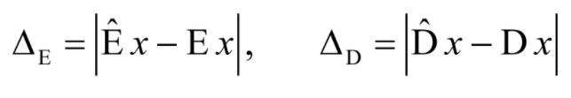
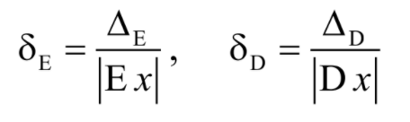
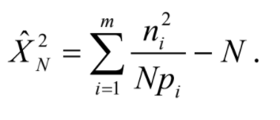
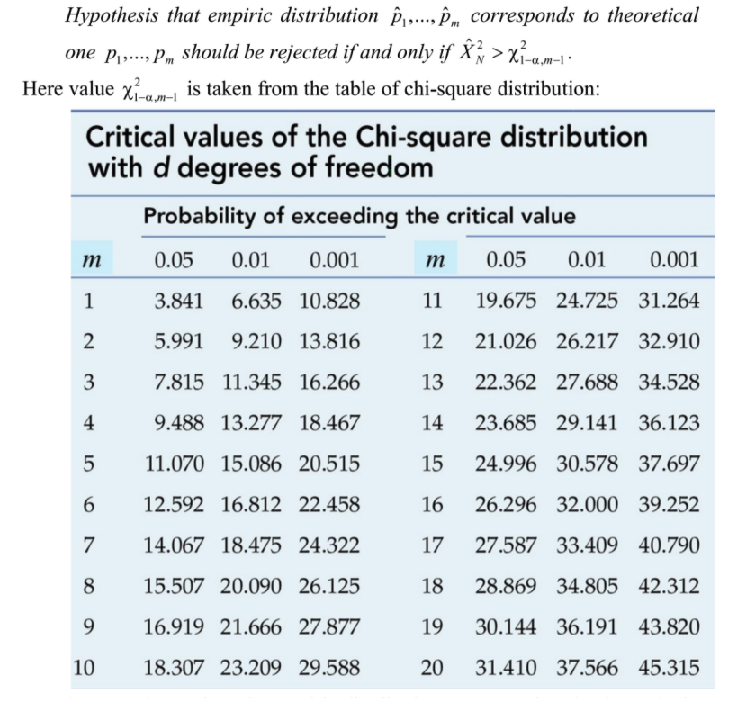
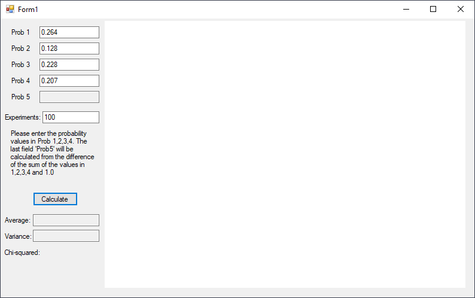
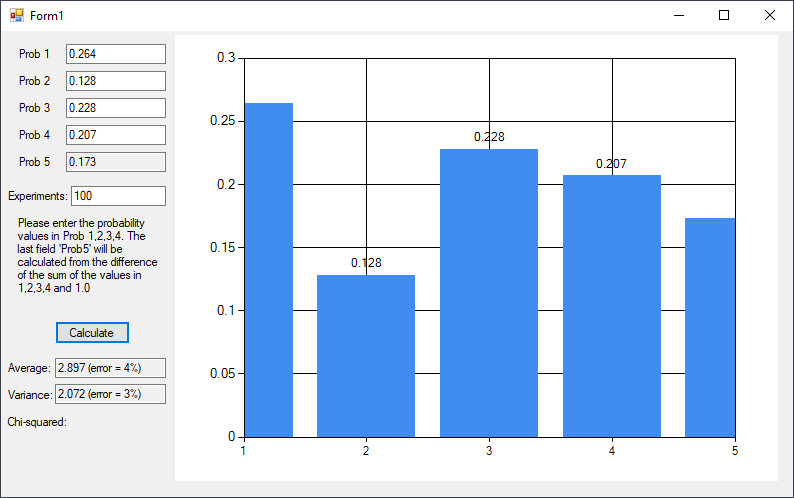

# Discrete Variables
> From May 21, 2020

In order to verify the distribution's characteristics inside of the statistical processing of discrete random variables **RV** we have the following distribution:



The variance and expected value are calculated with the following formulas:



With this set is possible to evaluate the empiric distribution, as we already cover with a [Group of events](https://pableins.com/series/simulation-and-statistics/random-events/#group-of-events).



By using this values we can calculate the empiric expected value and relative variance of values of X<sub>i</sub> with the following formulas:



With the resulting values we can verify the empiric results with the theoretical ones based on absolute errors.



and relative errors



Generally relative errors are presented by percentage, so the bigger the expected value's result is and the variance as well, we can expect that the bigger the simulation's error will be. Depending on the experiment, values of 1%, 5% or 10% are acceptable, and if *expected value*'s the theoretical values and the variance are not known we use the empirical ones as approximation.

If the margin of error is smaller is possible to calculate the distribution with **Chi-squared** test.



By fixing the value of `alfa (∝)` that will define the precision of the test method, given by the following hypothesis:



This way the empirical estimation of the distribution corresponds to the theoretical one in a big number of events `N`, in which is possible to compare the values and reach a conclusion.

## Result





### Implementation
```csharp
Random rand = new Random();
int i = 0;
double sum, p5 = 0;

int n = int.Parse(textBox6.Text) //Experiments

double p1 = double.Parse(textBox1.Text); // Prob 1
double p2 = double.Parse(textBox2.Text); // Prob 2
double p3 = double.Parse(textBox3.Text); // Prob 3
double p4 = double.Parse(textBox4.Text); // Prob 4

sum = p1 + p2 + p3 + p4;
p5 = 1 - sum;

if (p5 < 0) p5 = 0;
textBox5.Text = p5.ToString("0.000");

double[] experiments = new double[5];
double[] frequency = new double[5];

this.chart1.Series["Series1"].Points.AddXY("1", p1);
this.chart1.Series["Series1"].Points.AddXY("2", p2);
this.chart1.Series["Series1"].Points.AddXY("3", p3);
this.chart1.Series["Series1"].Points.AddXY("4", p4);
this.chart1.Series["Series1"].Points.AddXY("5", p5);

//Expected Value - µ
double xp1 = 1 * p1;
double xp2 = 2 * p2;
double xp3 = 3 * p3;
double xp4 = 4 * p4;
double xp5 = 5 * p5;
double miu = xp1 + xp2 + xp3 + xp4 + xp5;

//Variance - µ
double x2p1 = (1*1) * p1;
double x2p2 = (2*2) * p2;
double x2p3 = (3*3) * p3;
double x2p4 = (4*4) * p4;
double x2p5 = (5*5) * p5;
double variance = x2p1 + x2p2 + x2p3 + x2p4 + x2p5;

variance -= (miu * miu);

experiments[0] = 0;
experiments[1] = 0;
experiments[2] = 0;
experiments[3] = 0;
experiments[4] = 0;

while (i < n)
{
    int r = rand.Next(1, 6);

    if (r == 1) experiments[0]++;
    else if (r == 2) experiments[1]++;
    else if (r == 3) experiments[2]++;
    else if (r == 4) experiments[3]++;
    else if (r == 5) experiments[4]++;

    i++;
}

i = 0;
foreach (var item in experiments)
{
    frequency[i++] = item / n;
}

double e_miu = 1 * frequency[0] +
               2 * frequency[1] +
               3 * frequency[2] +
               4 * frequency[3] +
               5 * frequency[4];

double e_variance = (1 * 1) * frequency[0] +
                    (2 * 2) * frequency[1] +
                    (3 * 3) * frequency[2] +
                    (4 * 4) * frequency[3] +
                    (5 * 5) * frequency[4];

e_variance -= (e_miu * e_miu);

//Errors
double miuError = Math.Abs(e_miu - miu) / Math.Abs(miu);
double varianceError = Math.Abs(e_variance - variance) / Math.Abs(variance);
```

[](https://github.com/pablinme/sim-discrete-variables)
