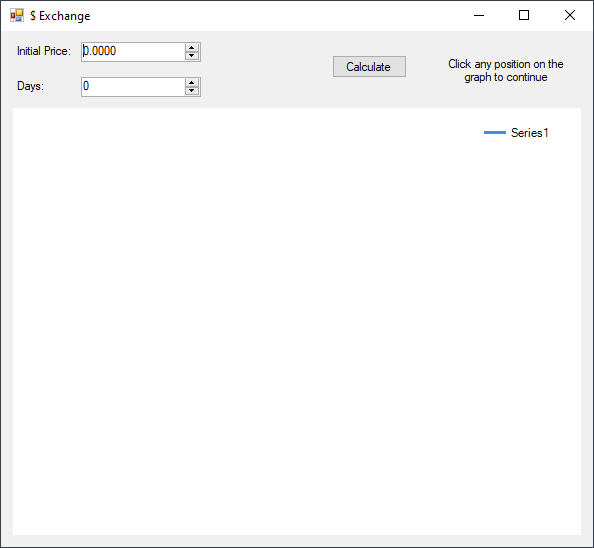
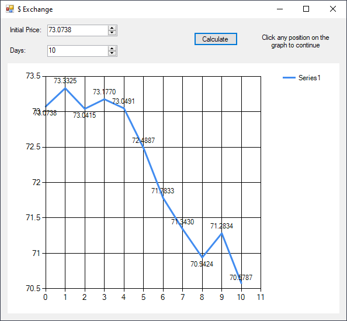
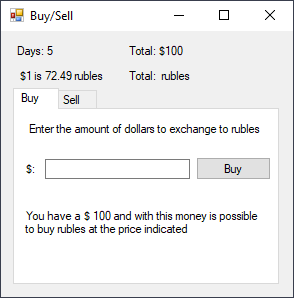

# Exchange Rate
> From March 25, 2020

With the following stochastic-forecast model `C = C * (1 + k * (rand - 0.5))` we are going to simulate an exchange rate.



## Result





### Implementation
```csharp
// class variables
const double k = 0.02;
Random random = new Random();

chart1.Series[0].Points.Clear();

int days = (int) inputDays.Value;
double price = (double) inputPrice.Value;
chart1.Series[0].Points.AddXY(0, price);

for (int i = 1; i <= days; i++)
{
    price = price * (1 + k * (random.NextDouble() - 0.5));
    chart1.Series[0].Points.AddXY(i, price);
}
```

[](https://github.com/pablinme/sim-exchange-rate)
