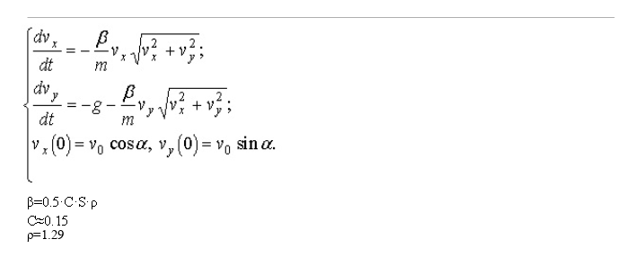
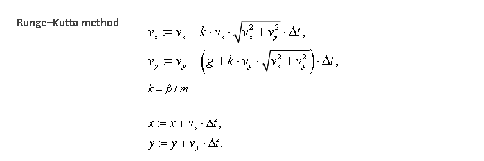
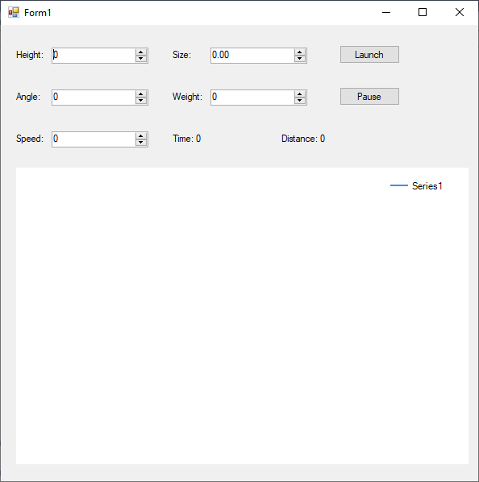
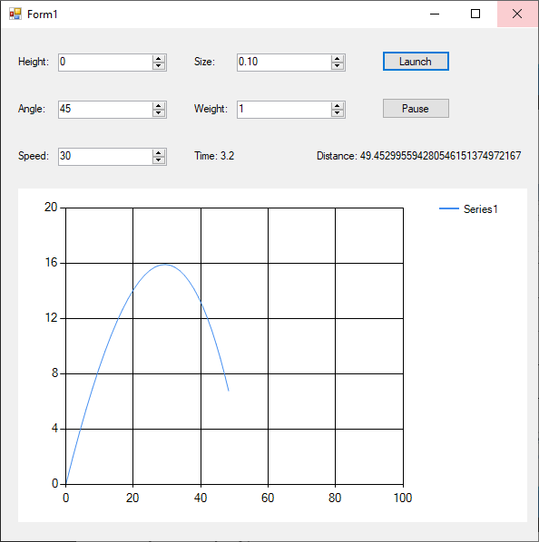

# Flight with atmosphere
> From March 18, 2020

Given the following model we are going to simulate a flight trajectory taking atmosphere into consideration.



First we have to solve the model and that's what will be implemented in the program.



## Result





## Implementation

### First Model
```csharp
chart1.Series[0].Points.Clear();
flight = new Flight(inputHeight.Value, inputSpeed.Value, inputAngle.Value, inputSize.Value, inputWeight.Value);
chart1.Series[0].Points.AddXY(flight.X, flight.Y);
timer1.Start();
```
---

### Model on each unit of time
```csharp
flight.NextStep();
label4.Text = "Time: " + flight.T;
label7.Text = "Distance: " + flight.X;
chart1.Series[0].Points.AddXY(flight.X, flight.Y);
             
if (flight.Y <= 0)
{
    timer1.Stop();
}
```
---

### Model
```csharp
using System;
using System.Collections.Generic;
using System.Linq;
using System.Text;
 
namespace Simulation_Lab3
{
    class Flight
    {
        decimal t, s;
        decimal x, y;
        decimal v, v0;

        decimal m, k;
        decimal vx, vy;
        decimal cosa, sina;
        const decimal C = 0.15M;
        const decimal g = 9.81M;
        const decimal dt = 0.1M;
        const decimal rho = 1.29M;
        
        public decimal T { get { return t; } }
        public decimal X { get { return x; } }
        public decimal Y { get { return y; } }

        public Flight(decimal inputHeight, decimal inputSpeed, decimal inputAngle, decimal inputSize, decimal inputWeight)
        {
            t = 0;
            x = 0;

            y = inputHeight;
            v0 = inputSpeed;

            double a = (double) inputAngle * Math.PI / 180;
            cosa = (decimal) Math.Cos(a);
            sina = (decimal)Math.Sin(a);
    
            s = inputSize;
            m = inputWeight;
            
            k = 0.5M * C * rho * s / m;
            vx = v0 * cosa;
            vy = v0 * sina;
        }

        public void NextStep()
        {
            t += dt;

            v = (decimal) Math.Sqrt((double)(vx * vx + vy * vy));
            vx = vx - k * vx * v * dt;
            vy = vy - (g + k * vy * v) * dt;
    
            x = x + vx * dt;
            y = y + vy * dt;
        }
    }
}
```

[](https://github.com/pablinme/sim-flight-with-atmosphere)
