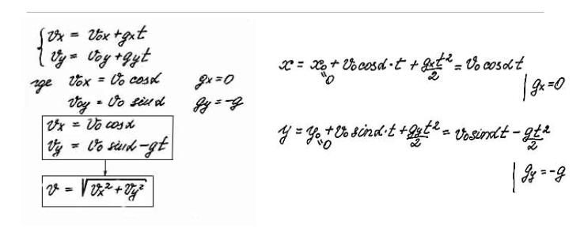
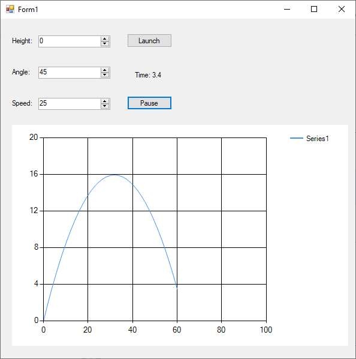

# Flight without atmosphere
> From March 11, 2020

Given the following model we are going to simulate a flight trajectory without taking atmosphere into consideration



## Result




## Implementation
### First Model
```csharp
t = 0;
x0 = 0;
y0 = inputHeight.Value;
v0 = inputSpeed.Value;

double a = (double) inputAngle.Value * Math.PI / 180;

cosa = (decimal) Math.Cos(a);
sina = (decimal)Math.Sin(a);

chart1.Series[0].Points.AddXY(x0, y0);
timer1.Start();
```
---

### Model on each unit of time
```csharp
const decimal dt = 0.1M;
const decimal g = 9.81M;

t += dt;
decimal x = x0 + v0 * cosa * t;
decimal y = y0 + v0 * sina * t - g * t * t /  2;

label4.Text = "Time: " + t;
chart1.Series[0].Points.AddXY(x, y);

if (y <= 0)
{
    timer1.Stop();
}
```

[](https://github.com/pablinme/sim-flight-without-atmosphere)
