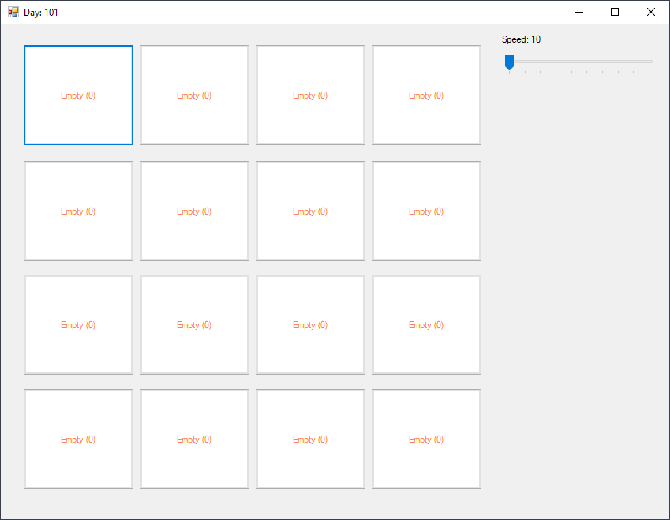
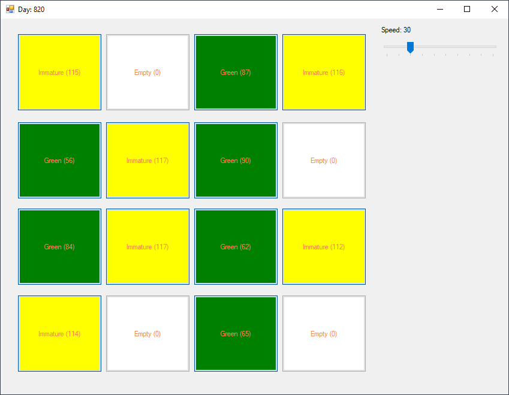
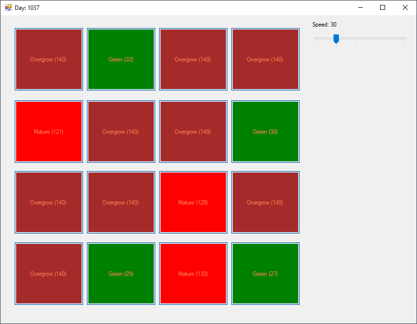

# Growing Vegetables
> From March 04, 2020

Given a 16 cells field (4x4)

In each cell is possible to sow one seed, at first all cells are empty and by doing click on them the whole process begins. Depending on the state you harvest the contents of the cell by doing a second click on it.

The states of the cell should be as follows:
- White  -> empty
- Black   -> just planted
- Green  -> growing
- Yellow -> immature
- Red     -> mature
- Brown -> overgrown

*one should be able to control growth's speed.

## Initial Status


## Growing




## Implementation

### States
```csharp
enum CellState
{
    Empty,
    Planted,
    Green,
    Immature,
    Mature,
    Overgrow
}
```
---

### Cell
```csharp
class Cell
{
    public double step = 0.1;
    public double progress = 0;
    public CellState state = CellState.Empty;

    private const int prPlanted = 20;
    private const int prGreen = 100;
    private const int prImmature = 120;
    private const int prMature = 140;

    public void Plant()
    {         
        state = CellState.Planted;
        progress = 1;
    }

    public void Harvest()
    {         
        state = CellState.Empty;         
        progress = 0;     
    }     

    public void NextStep()     
    {         
        if ((state != CellState.Empty) && (state != CellState.Overgrow))         
        {             
            progress += step;             

            if (progress < prPlanted) state = CellState.Planted;            
            else if (progress < prGreen) state = CellState.Green;             
            else if (progress < prImmature) state = CellState.Immature;             
            else if (progress < prMature) state = CellState.Mature;             
            else state = CellState.Overgrow;         
        }     
    }
}
```
[](https://github.com/pablinme/sim-growing-vegetables)
