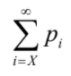
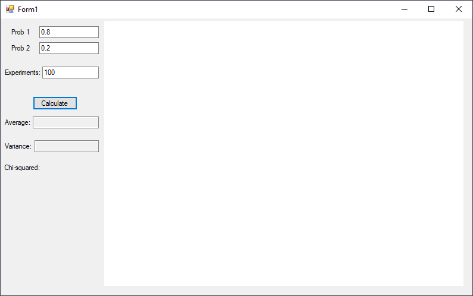
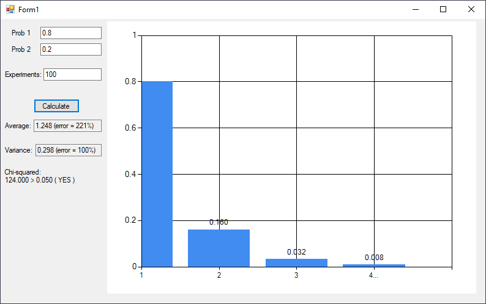

> From June 04, 2020

Applying the chi-square test for the case of discrete random variables with an infinite number of values `(m = ∞)`. In this case the distribution can be geometric or poisson's, an infinite number of intervals are used by grouping some of the values. The values are grouped on intervals as long as the probability's total do not exceed the probabilities of some other value, in general large values of **x** are used.

The total of the probability will have a value near or less than the probabilities P<sub>i</sub> of the other values `i < X`, in this procedure  from the statistical calculation all values are accounted, starting with `X` as a singular value with a probability equal to:



For example with `p = 0.8` we can get the geometric distribution, by making the **chi-square** test we can consider the distribution of the probability with the values `0, 1, 2 and > 2` with the probabilities `0.8, 0.16, 0.32 and 0.008` to apply the standard procedure of the test.

## Result





### Implementation
```csharp
int i = 0;
double sum = 0;

int n = int.Parse(textBox6.Text);
double param1 = double.Parse(textBox1.Text);
double param2 = double.Parse(textBox2.Text);

double p1 = param1;
double p2 = p1 * param2;
double p3 = p2 * param2;
double p4 = 1 - (p1 + p2 + p3);

sum = p1 + p2 + p3 + p4;

double[] e_probabilities = new double[4];
double[] probabilities = new double[4];
double[] experiments = new double[4];
double[] frequency = new double[4];

this.chart1.Series["Series1"].Points.AddXY("1", p1);
this.chart1.Series["Series1"].Points.AddXY("2", p2);
this.chart1.Series["Series1"].Points.AddXY("3", p3);
this.chart1.Series["Series1"].Points.AddXY("4...", p4);

//Expected Value - µ
double xp1 = 1 * p1;
double xp2 = 2 * p2;
double xp3 = 3 * p3;
double xp4 = 4 * p4;

double miu = xp1 + xp2 + xp3 + xp4;

//Variance - µ
double x2p1 = (1*1) * p1;
double x2p2 = (2*2) * p2;
double x2p3 = (3*3) * p3;
double x2p4 = (4*4) * p4;

double variance = x2p1 + x2p2 + x2p3 + x2p4;

variance -= (miu * miu);

experiments[0] = 0;
experiments[1] = 0;
experiments[2] = 0;
experiments[3] = 0;

e_probabilities[0] = xp1;
e_probabilities[1] = xp2;
e_probabilities[2] = xp3;
e_probabilities[3] = xp4;

probabilities[0] = p1;
probabilities[1] = p2;
probabilities[2] = p3;
probabilities[3] = p4;

while (i < n)
{
    // Any value greater than zero, x > 0 | nonnegative integers
    // A countable set of infinite values
    int r = rand.Next(1, Int32.MaxValue);
    
    if (r == 1) experiments[0]++;
    else if (r == 2) experiments[1]++;
    else if (r == 3) experiments[2]++;
    else if (r >= 4) experiments[3]++;
    i++;
}

i = 0;
foreach (var item in experiments)
{
    frequency[i++] = item / n;
}

double e_miu = 1 * frequency[0] +
               2 * frequency[1] +
               3 * frequency[2] +
               4 * frequency[3];

double e_variance = (1 * 1) * frequency[0] +
                    (2 * 2) * frequency[1] +
                    (3 * 3) * frequency[2] +
                    (4 * 4) * frequency[3];

e_variance -= (e_miu * e_miu);

//Errors
double miuError = Math.Abs(e_miu - miu) / Math.Abs(miu);
double varianceError = Math.Abs(e_variance - variance) / Math.Abs(variance);

//Chi
double chi = 0;
double alfa = 0.05;

for (i = 0; i < 4; i++)
{
    chi += Math.Pow((frequency[i] - probabilities[i]), 2) / probabilities[i];
}
textBoxAverage.Text = miu.ToString("0.000") + " (error = "+ Math.Round((miuError * 100)).ToString() + "%)";
textBoxVariance.Text = variance.ToString("0.000") + " (error = " + Math.Round((varianceError * 100)).ToString() + "%)";

labelChi.Text = "Chi-squared: \r\n" + chi.ToString("0.000") + " > " + alfa.ToString("0.000") + " ( " + ((chi > alfa) ? "YES" : "FALSE") + " )";
```

[](https://github.com/pablinme/sim-infinite-values)
