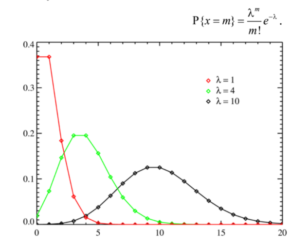
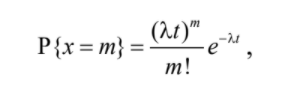
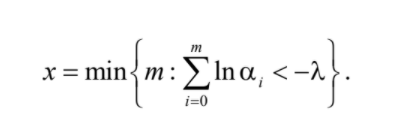
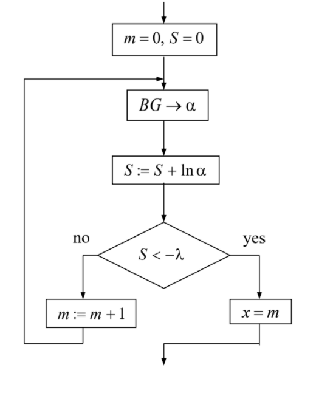
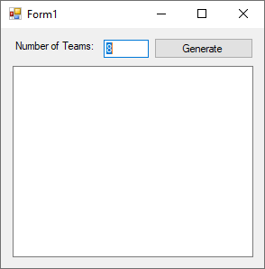
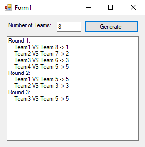

> From June 01, 2020

The Poisson distribution represents the probability of the distribution of a number of events occurred in fixed interval of time, if this events happen independently and with a fixed constant mean defined by `λ`.

The values of that random variable `X = 0, 1, 2, .... ,` and its probability's distribution can be evaluated by



The distribution's law can also be found by the following:



Where `t` is the length of the observation's interval, `λ` is the intensity of the occurrences of the event by unit of time.



So given the following *generator*, the simulation's algorithm is the following:



## Result





### Team
```csharp
class Team
{
    public int ID { get; private set; }
    public bool Flag { get; set; }
    public int AverageGoals { get; private set; }
    private Random rand;

    public Team(int ID)
    {
        this.ID = ID;
        this.Flag = false;
        rand = new Random(ID);
        this.AverageGoals = rand.Next(8);
    }
```
---

### Helpers
```csharp
private const int ELIMINATED = -1;

private float Poisson(int miu, int x)
{
    int factorial = 1;
    for(int i = x; i > 0; i--)
    {
        factorial *= i;
    }
    return (float) (Math.Pow(miu, x) * (Math.Exp(-miu)) / factorial);
}

private Team GetWinner(Team t1, Team t2)
{
    Random rand = new Random();

    int goalsTeam1 = rand.Next(10);
    int goalsTeam2 = rand.Next(10);
    
    float n1 = Poisson(t1.AverageGoals, goalsTeam1);
    float n2 = Poisson(t2.AverageGoals, goalsTeam2);

    return n1 > n2 ? t1 : t2;
}
```
---

### Main
```csharp
int rounds = 0;
int num_teams = 0;
num_teams = int.Parse(textBox1.Text);

rounds = (int) Math.Log(num_teams, 2.0);

List<Team> teams = new List<Team>();

for (int i = 0; i < num_teams; i++)
{
    Team temp = new Team(i + 1);
    teams.Add(temp);
}

// Display the result.
string txt = "";

for (int round = 0; round < rounds; round++)
{
    int n1 = teams.Count;
    txt += "Round " + (round + 1) + ":\r\n";
    
    for (int i = 0; i < (n1 * 0.5); i++)
    {
        Team team1 = teams[i];
        Team team2 = teams[n1 - (i + 1)];
        Team winner = GetWinner(team1, team2);

        txt += "    Team" + (team1.ID) + " VS Team " + (team2.ID) + " -> " + (winner.ID) + "\r\n";

        if (winner == team1)
        {
            teams[i].Flag = true;
            teams[n1 - (i + 1)].Flag = false;

            //txt += "    Team" + (team2.ID) + " (ELIMINATED)\r\n";
        }
        else
        {
            teams[i].Flag = false;
            teams[n1 - (i + 1)].Flag = true;

            //txt += "    Team" + (team1.ID) + " (ELIMINATED)\r\n";
        }
    }

    teams.RemoveAll(x => x.Flag == false);

    if(teams.Count == 1)
    {
        break;
    }
}
textBox2.Text = txt;
```

[](https://github.com/pablinme/sim-poisson-distribution)
