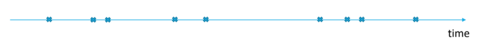
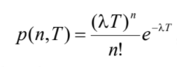
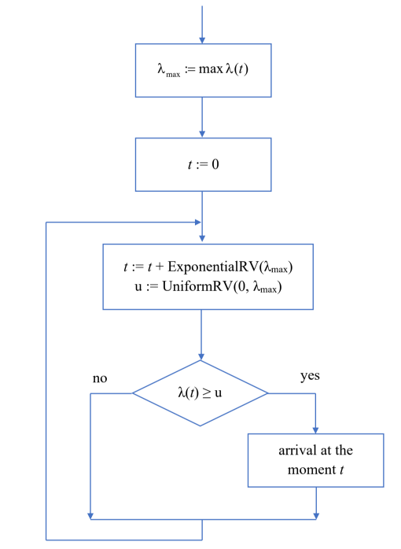
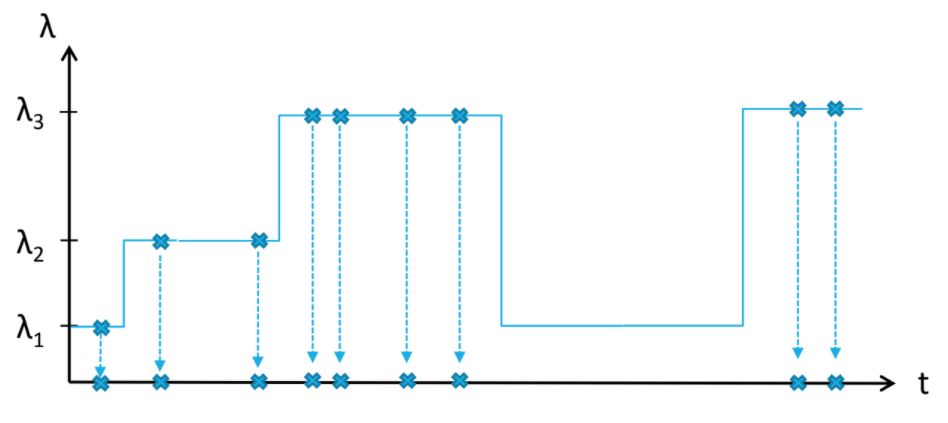
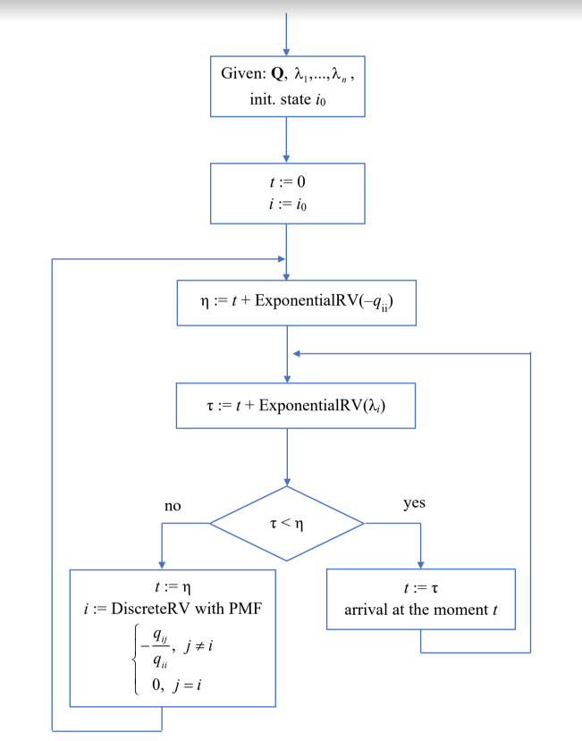
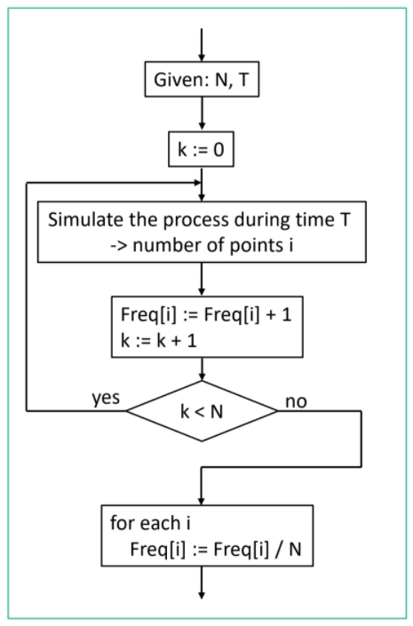
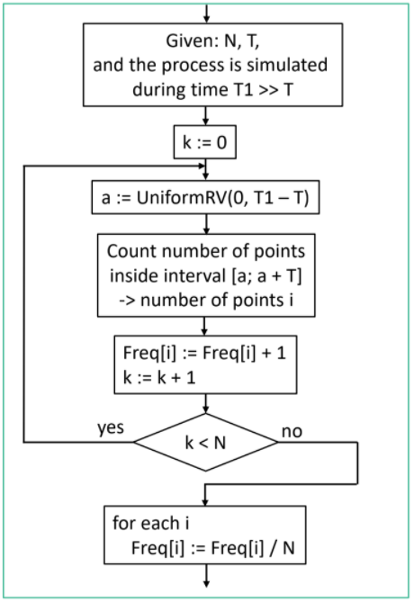
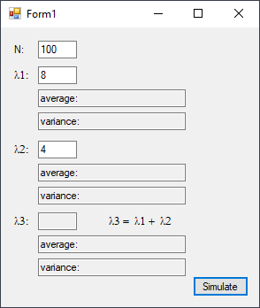
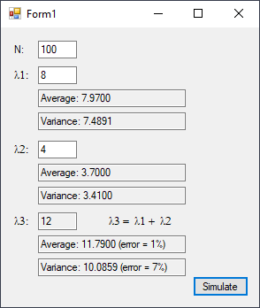

# Poisson Process
> From June 30, 2020

## Introduction
In statistics and simulation, a Poisson process is stochastic of continuous-time that generally consists on “counting” the events as they occur over a period of time, as this events occur continuously and are independent to one another.

If the is homogeneous events occurring on an instant inside of a continuous-time event (they are homogeneous assuming that them have the same origin and probabilities, so this wouldn't differ unless specified by the model). This process is called “Point Process” which is basically a flow of homogeneous events.



In order to create a model out of this flow, we can reduce it to model the elements on the time as events occur, or in other words, model time intervals that took place between events that are close to each other.

Poisson process may be the most popular among stationary  processes and have the following properties:

- **Independence**: events occur independently of one another.
- **Ordinariness**: only one event can occur at any given time.
- **Stationary**: the number of occurrences of an event in an interval, do not depends on the starting point of the interval.

The probability `p(n, T)` of `n` events occur over a period of time with length `T` is determined by the following expression.



where `λ` is the intensity of the process (percentage of events by each unit of time). The probability of an event occurring during an interval of time with length `∆t` is equal to `λ ∙ ∆t + o(∆t)`, and length `t` of the time interval between the occurrence of two close events is an exponential random variable with parameter `λ`.

The length between two time events is written as t<sub>1</sub> - t<sub>0</sub> = t<sub>0</sub> , t<sub>2</sub> - t<sub>1</sub> = t<sub>1</sub>, ... , this way can be simulated as exponential random variables, independent with a parameter λ: t<sub>i</sub> = - ln α / λ

## Non stationary Poisson Processes
The probability of the occurrence of an event within an interval `[t; t + ∆t]` is `λ(t) ∙ ∆t + o(∆t)` (**λ** depends of the time-instant *t*), so the number of events inside the intervals with the same length will not only depend on the interval's length, but also on the location on the time axis.



## Markov Chain
While having some stationary poisson processes and interchanging them. This process of *flow change* is a Markov Chain with continuous time, so it becomes necessary to specify a matrix that will determine flow changes and their intensity.

`λ1, λ2, λ3, ... , λn`

This Markov chain is a control chain with the following characteristics:

The evolution of the chain [Blue] and the implementation of the events (cross) as follows.



## Algorithm



## Statistical Processing
For this kind of processes, an important characteristic is that the distribution of the length of the intervals between events that occur simultaneously  and the distribution of the number of events that occurred over that period of time. This can be analyzed as stationary flows (when the intensity of the flow do not change overtime) so the statistical processing is described as stationary.

The length of the intervals t<sub>i</sub> between the occurrence of these events are continuous random variables, to analyze these events that happen on a determined time-space, is necessary to select the length of the time interval **T**. After that the simulation of this flow is performed -large enough-  **N** times to simulate the flow overtime, counting each time the number of events that happen in the flow:



When the simulation have finished, or is not possible to repeat it, an interval of length `T` can be fixed in an arbitrary place on the simulation, watch the flow and calculate the number of events in the interval. The resulting number will be the occurrence of a random variable of the number of events that have occurred on the flow over time `T`. So this procedure is repeated N times during intervals of length `T` located -randomly- on different spaces:



The result will be a sample of N positive integers for which the methods of statistical processing can be applied, from the result of a simulation of a discrete random variable, this procedure should be repeated for different values of T.

## Example
Simulate two poisson processes with intensities`λ1 and λ2`. 
Capture the events of both processes at once, analyze the data of this process by aggregating the stationary process with intensity `(λ1 + λ2)`.

## Result





## Implementation

### Poisson variable, given 'lambda'
```csharp
int poissonVariable;
double randomVariable;
double randomVariableProduct;

double precision = Math.Exp(-lambda);

poissonVariable = -1;
randomVariableProduct = 1;

do
{
    randomVariable = random.NextDouble();
    randomVariableProduct *= randomVariable;
    poissonVariable++;
} while (randomVariableProduct > precision);

return poissonVariable;
```
---

### Main
```csharp
double n = double.Parse(textBoxNumSim.Text); //N
double[] lambdas = new double[3];

lambdas[0] = double.Parse(textBoxInten1.Text); //Lambda 1
lambdas[1] = double.Parse(textBoxInten2.Text); //Lambda 2
lambdas[2] = lambdas[0] + lambdas[1];

textBoxInten3.Text = lambdas[2].ToString(); //Lambda 3

int temp1, temp2, temp3;

double sumPoisson1 = 0;
double sumPoisson2 = 0;
double sumPoisson3 = 0;

double sumPoissonSquared1 = 0;
double sumPoissonSquared2 = 0;
double sumPoissonSquared3 = 0;

for (int i = 0; i < n; i++)
{
    temp1 = generateSinglePoissonVariable(lambdas[0]);
    temp2 = generateSinglePoissonVariable(lambdas[1]);
    temp3 = generateSinglePoissonVariable(lambdas[2]);

    sumPoisson1 += temp1;
    sumPoisson2 += temp2;
    sumPoisson3 += temp3;

    sumPoissonSquared1 += (temp1 * temp1);
    sumPoissonSquared2 += (temp2 * temp2);
    sumPoissonSquared3 += (temp3 * temp3);
}

double meanL1 = sumPoisson1 / ((double) n);
double meanL2 = sumPoisson2 / ((double) n);
double meanL3 = sumPoisson3 / ((double) n);

double varianceL1 = sumPoissonSquared1 / ((double) n) - (meanL1 * meanL1);
double varianceL2 = sumPoissonSquared2 / ((double) n) - (meanL2 * meanL2);
double varianceL3 = sumPoissonSquared3 / ((double) n) - (meanL3 * meanL3);

double averageError = Math.Abs(meanL3 - (meanL1 + meanL2)) / Math.Abs((meanL1 + meanL2));
double varianceError = Math.Abs(varianceL3 - (varianceL1 + varianceL2)) / Math.Abs((varianceL1 + varianceL2));

textBoxL1Mean.Text = "Average: " + meanL1.ToString("0.0000");
textBoxL2Mean.Text = "Average: " + meanL2.ToString("0.0000");
textBoxL3Mean.Text = "Average: " + meanL3.ToString("0.0000") +
                     " (error = " + Math.Round((averageError * 100)).ToString() + "%)";

textBoxL1Variance.Text = "Variance: " + varianceL1.ToString("0.0000");
textBoxL2Variance.Text = "Variance: " + varianceL2.ToString("0.0000");
textBoxL3Variance.Text = "Variance: " + varianceL3.ToString("0.0000") +
                         " (error = " + Math.Round((varianceError * 100)).ToString() + "%)";
```

[](https://github.com/pablinme/sim-poisson-process)
