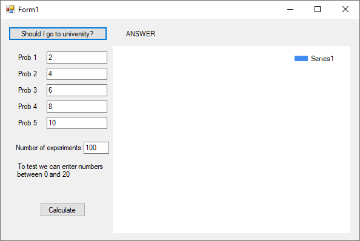

# Random Events
> From May 05, 2020

Considering that an event `A` can occur with a probability `p=p(A)`.

From probability's theory we know that uniformly-distributed probability at `[0:1]`. 
One random value fits into the interval with length `p` inside the range `[0:1]` so in this case `P{α < p} = p = P{A}`

α is generated by the *base generator*, according to the following:


### Base generator
```csharp
Random rand = new Random();

int n = rand.Next();
string answer = "No";

if (n % 2 == 1)
{
    answer = "Yes";
}
```
---

## Group of events
Given A<sub>1</sub>, A<sub>2</sub>, . . . , A<sub>m</sub> as a collective group of events, we have that P{A<sub>i</sub>} = p<sub>i</sub> where i=1 ∑<sup>m</sup> p<sub>i</sub> = 1 dividing the interval `[0;1]` into intervals of length p<sub>i</sub>


We can use the property that uniformly distributed probability at `[0;1]` on the random variable matches with the interval of length **p** inside of `[0;1]` and is equal to `p`. 

So now we have the algorithm as follows:


## Result




### Implementation
```csharp
int i = 0;

int n1 = int.Parse(textBox1.Text); // Prob 1
int n2 = int.Parse(textBox2.Text); // Prob 2
int n3 = int.Parse(textBox3.Text); // Prob 3
int n4 = int.Parse(textBox4.Text); // Prob 4
int n5 = int.Parse(textBox5.Text); // Prob 5

int n = int.Parse(textBox6.Text); // number of experiments
int[] experiments = new int[5];
double[] frequency = new double[5];

experiments[0] = 0;
experiments[1] = 0;
experiments[2] = 0;
experiments[3] = 0;
experiments[4] = 0;

while(i < n)
{
    int r = rand.Next(20);

    if (n1 == r) experiments[0]++;
    else if (n2 == r) experiments[1]++;
    else if (n3 == r) experiments[2]++;
    else if (n4 == r) experiments[3]++;
    else if (n5 == r) experiments[4]++;
    i++;
}

i = 0;
foreach (var item in experiments)
{
    frequency[i] = item / 20;
}
```

[](https://github.com/pablinme/sim-random-events)
