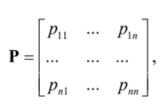
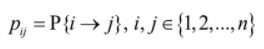
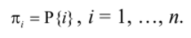
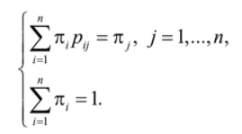
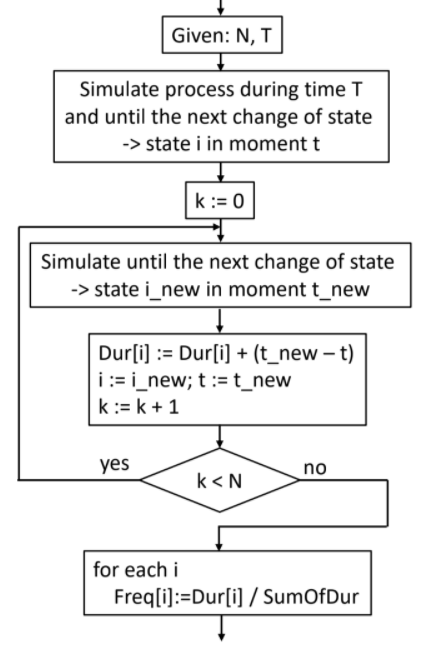
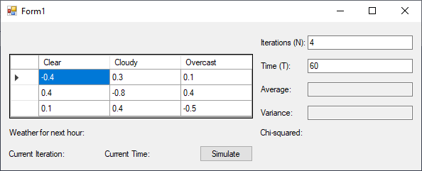
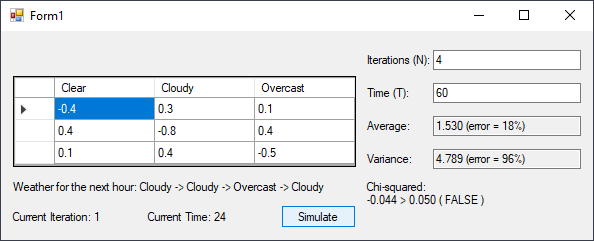

> From June 19, 2020

In a system that can change its state, if we define the possible states as  `1, 2, 3, ... , n`. The states as X<sub>1</sub>, X<sub>2</sub>, X<sub>3</sub>, ... , X<sub>n</sub>.

The changes on the states will happen on discrete instants of time t<sub>1</sub>, t<sub>2</sub>, t<sub>3</sub>, ... This process of change in the system are called “Markov Chain” and satisfies the following property -Markov Chain main property- The *following state* in the process **depends only** on the *current state* and no other previous state.

The transitions between states in Markov Chain are determined by a transition matrix P = || p<sub>ij</sub> ||



Where



P<sub>ij</sub> are the probabilities of the process changing from its state `i` to `j` -on any instant- in which the transition is possible.

On most Markov chains is possible to determine the final distribution



`P{i}` is the probability that the process is on state **i** in an arbitrary instant of time. The stationary probabilities *πi* are found by the following linear system.



## Statistical Processing
Each simulation of the experiment have to give a chain of results that will differ from others, so which information shall we extract in order to analyze, and which we could use to perform comparisons?

In practice stationary distribution is used, that can be obtained only after of a long simulation of a process. It begins by picking a value **T** of a period of time and we assume that after its evolution during that period, the process will be almost stationary so we also pick a number **N** that will determine the times the experiments will perform.

## Algorithm
After a period with length **T** a stationary distribution is maintained so is not necessary to perform the simulation from the beginning to  **T**, it can be made until a sample is obtained -numbers of state changes- equal to **N**.



## Description
Simulate weather changes over a period of time according to the following transition matrix.

|             | CLEAR | CLOUDY | OVERCAST |
| ------- | :------: | ------:| --------:|
| CLEAR | -0.4   |  0.3   |  0.1     |
| CLOUDY |   0.4  | -0.8   |  0.4     |
| OVERCAST |   0.1  |  0.4   | -0.5     |


## Result





### States
```csharp
enum MyWeather
{
     Clear, Cloudy, Overcast 
}
```
---

### Implementation
```csharp
int i = 0;
int countClear = 0;
int countCloudy = 0;
int countOvercast = 0;

int w = 4;
double sum = 0;

int t = int.Parse(textBoxTime.Text);
int n = int.Parse(textBoxIterations.Text);

// A -- Clear = 0
// B -- Cloudy = 1
// C -- Overcast = 2
double w1 = -0.4; //  Clear->Clear
double w2 = -0.8; //  Cloudy->Cloudy
double w3 = -0.5;  // Overcast->Overcast

double w4 = 0.4;  // Cloudy->Clear   -- Overcast->Cloudy -- Cloudy->Overcast
double w5 = 0.1;  // Overcast->Clear -- Clear->Overcast
double w6 = 0.3;  // Clear->Cloudy

double p1 = 0.33; //in any stage it can start Clear, Cloudy or Overcast
double p2 = 0;
double p3 = 0;
double p4 = 0;

int[] weather = new int[w];
for (int it = 1; it <= n; it++)
{
    labelCurrentIteration.Invoke((MethodInvoker)delegate
    {
        labelCurrentIteration.Text = "Current Iteration: " + it.ToString();
        labelCurrentIteration.Update();
    });

    weather[0] = rand.Next(0, 3);
    weather[1] = rand.Next(0, 3);
    weather[2] = rand.Next(0, 3);
    weather[3] = rand.Next(0, 3);
    
    labelCurrentTime.Invoke((MethodInvoker)delegate
    {
        labelWeather.Text = "Weather for the next hour: " +
                           (MyWeather)weather[0] + " -> " +
                           (MyWeather)weather[1] + " -> " +
                           (MyWeather)weather[2] + " -> " +
                           (MyWeather)weather[3];
        labelWeather.Update();
    });

    for (int wi = 0; wi < weather.Length - 1; wi++)
    {
        if (weather[wi] == 0) // Clear
        {
            countClear++;

            if (weather[wi + 1] == 0) // Clear
            {
                if (wi+1 == 1) p2 = w1;
                else if (wi+1 == 2) p3 = w1;
                else if (wi + 1 == 3) p4 = w1;
            }
            else if (weather[wi + 1] == 1) // Cloudy
            {
                if (wi + 1 == 1) p2 = w6;
                else if (wi + 1 == 2) p3 = w6;
                else if (wi + 1 == 3) p4 = w6;
            }
            else if (weather[wi + 1] == 2) // Overcast
            {
                if (wi + 1 == 1) p2 = w5;
                else if (wi + 1 == 2) p3 = w5;
                else if (wi + 1 == 3) p4 = w5;
            }
        }
        if (weather[wi] == 1) // Cloudy
        {
            countCloudy++;

            if (weather[wi + 1] == 0 || weather[wi + 1] == 2) // Clear OR Overcast
            {
                if (wi + 1 == 1) p2 = w4;
                else if (wi + 1 == 2) p3 = w4;
                else if (wi + 1 == 3) p4 = w4;
            }
            else if (weather[wi + 1] == 1) // Cloudy
            {
                if (wi + 1 == 1) p2 = w2;
                else if (wi + 1 == 2) p3 = w2;
                else if (wi + 1 == 3) p4 = w2;
            }
        }
        if (weather[wi] == 2) // Overcast
        {
            countOvercast++;

            if (weather[wi + 1] == 0) // Clear
            {
                if (wi + 1 == 1) p2 = w5;
                else if (wi + 1 == 2) p3 = w5;
                else if (wi + 1 == 3) p4 = w5;
            }
            else if (weather[wi + 1] == 1) // Cloudy
            {
                if (wi + 1 == 1) p2 = w4;
                else if (wi + 1 == 2) p3 = w4;
                else if (wi + 1 == 3) p4 = w4;
            }
            else if (weather[wi + 1] == 2) // Overcast
            {
                if (wi + 1 == 1) p2 = w3;
                else if (wi + 1 == 2) p3 = w3;
                else if (wi + 1 == 3) p4 = w3;
            }
        }
    }

    sum = p1 + p2 + p3 + p4;
    double[] e_probabilities = new double[9];
    double[] probabilities = new double[9];
    double[] experiments = new double[9];
    double[] frequency = new double[9];

    //Expected Value - µ
    double xp1 = 1 * p1;
    double xp2 = 2 * p2;
    double xp3 = 3 * p3;
    double xp4 = 4 * p4;

    double miu = xp1 + xp2 + xp3 + xp4;

    //Variance - µ
    double x2p1 = (1 * 1) * p1;
    double x2p2 = (2 * 2) * p2;
    double x2p3 = (3 * 3) * p3;
    double x2p4 = (4 * 4) * p4;

    double variance = x2p1 + x2p2 + x2p3 + x2p4;
    variance -= (miu * miu);

    experiments[0] = 0;
    experiments[1] = 0;
    experiments[2] = 0;
    experiments[3] = 0;
    
    e_probabilities[0] = xp1;
    e_probabilities[1] = xp2;
    e_probabilities[2] = xp3;
    e_probabilities[3] = xp4;
   
    probabilities[0] = p1;
    probabilities[1] = p2;
    probabilities[2] = p3;
    probabilities[3] = p4;

    while (i < n)
    {
        int r = rand.Next(0, 3); // Clear - Cloudy - Overcast

        if (r == 1) experiments[0]++;
        else if (r == 2) experiments[1]++;
        else if (r == 3) experiments[2]++;
        else if (r >= 4) experiments[3]++;

        i++;
    }

    i = 0;
    foreach (var item in experiments)
    {
        frequency[i++] = item / n;
    }
    
    double e_miu = 1 * frequency[0] +
                   2 * frequency[1] +
                   3 * frequency[2] +
                   4 * frequency[3];
 
    double e_variance = (1 * 1) * frequency[0] +
                        (2 * 2) * frequency[1] +
                        (3 * 3) * frequency[2] +
                        (4 * 4) * frequency[3];

    e_variance -= (e_miu * e_miu);

    //Errors
    double miuError = Math.Abs(e_miu - miu) / Math.Abs(miu);
    double varianceError = Math.Abs(e_variance - variance) / Math.Abs(variance);

    //Chi
    double chi = 0;
    double alfa = 0.05;

    for (i = 0; i < 4; i++)
    {
        chi += Math.Pow((frequency[i] - probabilities[i]), 2) / probabilities[i];
    }
}
```

[](https://github.com/pablinme/sim-stochastic-processes)
