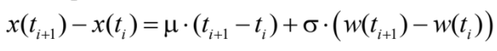
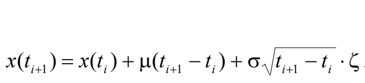
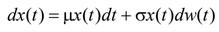
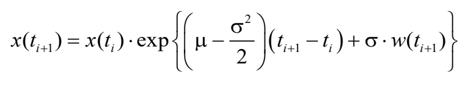
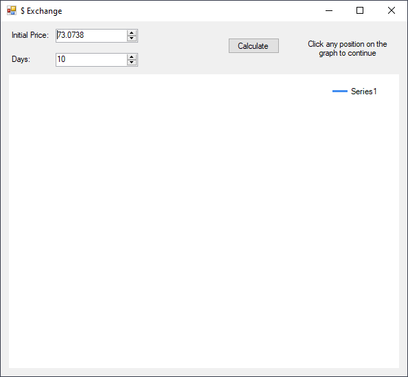
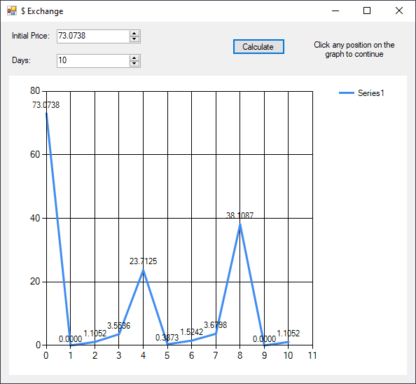
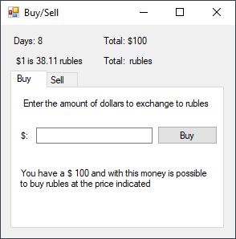

# Wiener Process
> From June 22, 2020

In a Wiener process w(t):

1. If the time intervals `[s, t]` and `[s', t']` do not intersect, then the increments `w(t) - w(s)` and `w(t') - w(s')` are independent random variables.
2. As the increments `w(t) - w(s)` are normal random variables with `E{w(t) - w(s)} = 0` and `Var{w(t) - w(s)} = t - s`

This way we have that w(t<sub>i+1</sub>) - w(t<sub>i</sub>) ~ N(0, t<sub>i+1</sub> - t<sub>i</sub>) for the simulation.

## Simulation
Given a normal random variable w(t<sub>i+1</sub>) = w(t<sub>i</sub>) + √(t<sub>i+1</sub> - t<sub>i</sub>) due time instants t<sub>i</sub> is posible to pick them as we see fit, as the moment in which two instants are -sufficiently short- to match to other process simulated on the system.

## Brownian Movement
Is given by the following equation:



For the simulation we will use



## Geometric Brownian Movement
Is given by the following stochastic differential equation



Its solution can be written in the following way



## Result







### Implementation
```csharp
Random random = new Random();
const int miu = 1;
const double k = 0.1; //0.02

int days = (int) inputDays.Value;
double price = (double) inputPrice.Value;

chart1.Series[0].Points.AddXY(0, price);

for (int i = 1; i <= days; i++)
{
    //price = price * (1 + k * (random.NextDouble() - 0.5));
    // e^((miu - (price*price/2)) * k + price * random)
    double w = miu + Math.Sqrt(k) * (random.NextDouble() - 0.5);
    price = Math.Exp((miu - (price*price/2)) * k + (price * w));
    chart1.Series[0].Points.AddXY(i, price);
}
```

[](https://github.com/pablinme/sim-wiener-process)
