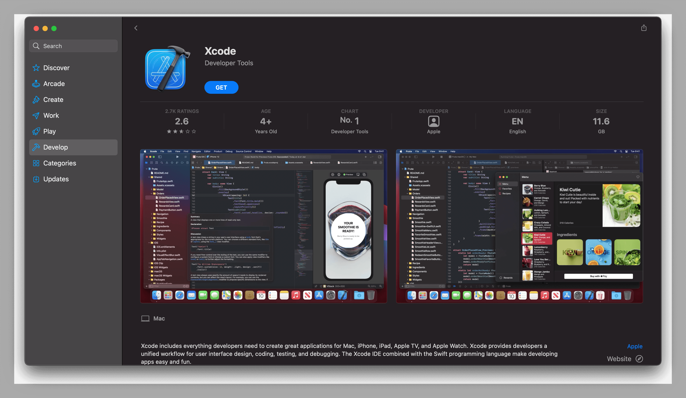
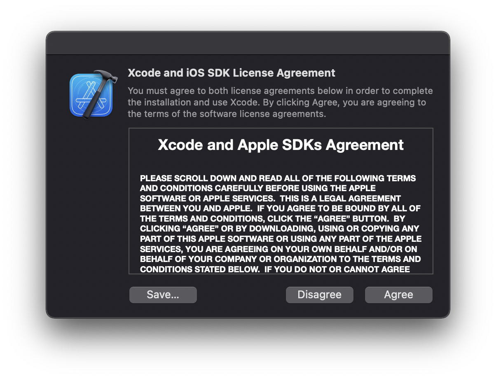
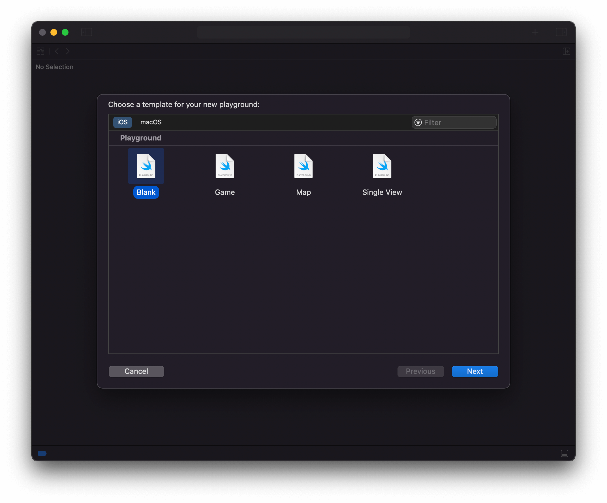
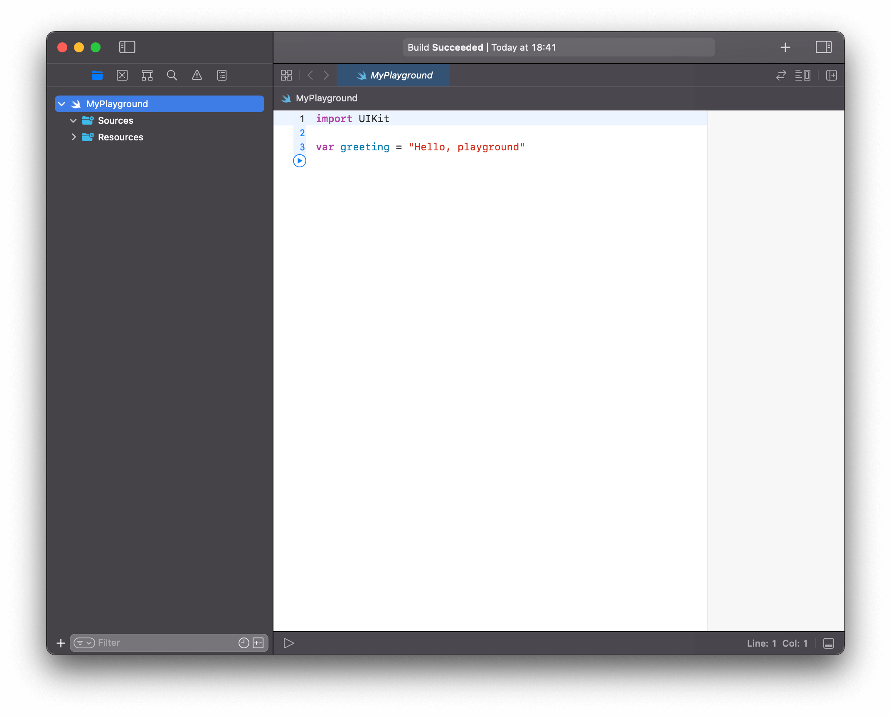
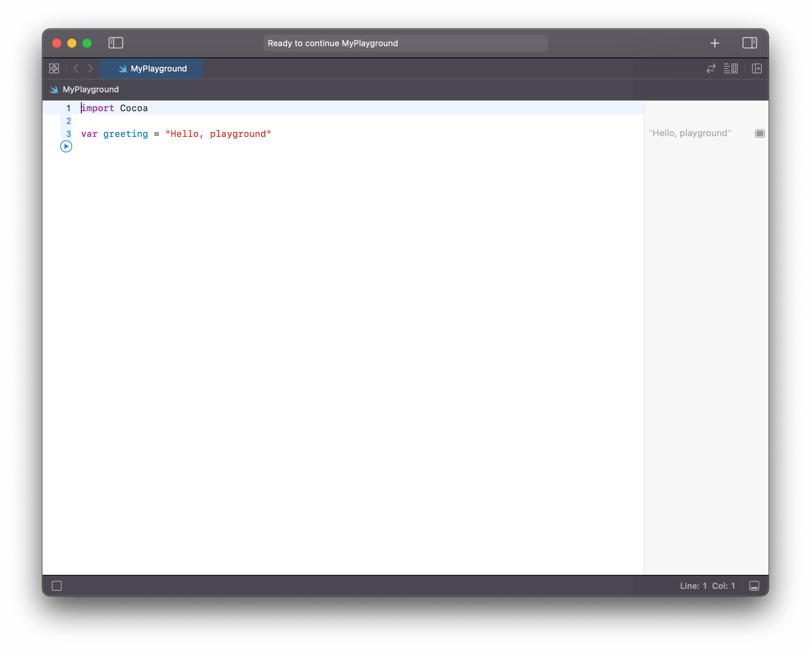

 <br>
Xcode is Apple’s integrated development environment (IDE) which consists of a suite of tools that developers use to build apps for Apple platforms.

***
## Getting Started
 <br>
Xcode can be downloaded from the Mac App Store or at Apple's developer portal, after its first launch Xcode's license agreement may appear which has to be agreed upon.

 <br>
At first is easier to start working with Playgrounds instead of full blown projects.

***
## Playgrounds
Xcode's playgrounds provide an interactive environment for developing and evaluating Swift code on the fly, playgrounds don't need to be compiled and run as a complete project since code is evaluated on the fly, so it becomes handy for experimenting, testing and prototyping.

When creating a **new playground** is possible to select between iOS and macOS templates, to begin with it can be either one as it makes no difference evaluating Swift code with standart libraries.

 <br>
After selecting the save location for the playground it should load with the code editor containing the sample code

```swift
import UIKit //iOS template
import Cocoa //macOS template

var greeting = "Hello, playground"
```

The playground loads as follows:

 <br>
On the left is the navigation area, that can be closed to make room for the Swift code editor and results on the right sidebar. The code in the editor is evaluated and run as the source code changes when possible.

The *import statement* allows the playground to have complete access to all APIs in the **imported** framework.
- **UIKit** imported on iOS template
- **Cocoa** imported on macOS template

```swift
import UIKit
import Cocoa
```
Below the import statements, we have the first line of Swift, in the following statement:

```swift
var greeting = "Hello, playground"
```

First we can notice the *assignment operator* -the equal sign- that is a binary operator since it has
- Lefthand side (lhs)
- Righthand side (rhs)

```swift
var lhs = rhs
let lhs = rhs
```

Then code on the righthand side of the **=** is assigned to the variable (var), or constant (let) on the lefthand side.   

In the example we have a variable named *greeting* that is assigned the **String** value "Hello, playground". In order to save information to use later on the program it can be stored on a variable or constant.
- **var** variable, its value can change later on
- **let** constant, its value remains constant after beign initialized

```swift
var greeting = "Hello, playground"
let fixed_greeting = "Hello, consant playground"
```

In this case it can be noticed on the righthand side that **Hello, playground** is between quotation marks, which indicates an **String**, an order collection of characters. Variables should have meaningful names, just take notice that Swift reserves some words for its own use, as seen on the example **var** and **let** are keywords used to declare *variable* and *constants* respectively.

***
## Running the Playground
To start a playground there's a small "play button" on the lefthand next to the code, and it can execute the code up to a desired location, as you move the coursor notice that the play button follows so the code can be executed up to the selected line of code.

 <br>
After clicking the play button on the left of the statement

```swift
var greeting = "Hello, playground"
```

The playground evaluates the declaration and initialization of the **greeting** variable, and its resulting evaluation will appear on the -righthand- sidebar

***
## Comments
If you want to include some text that shoudln't be evaluated as code, let it be a reminder about the code or an explanation even of what the code is doing.

### Single line
A short comment can be added with two slashes **//** and is meant to be contained on a single line

```swift
import UIKit //iOS template
import Cocoa //macOS template
```

All text that follows the *slashes* is not evaluated.

### Multi line
Sometimes we may want to include a longer comment along several lines and in order to do it you can put text between /* and */

```swift
/*
All text here will not be evaluated and
is useful when describing the code since
it can be put along multiple lines
*/
```

**Previous** [Introduction to Programming](../introduction-to-programming/)