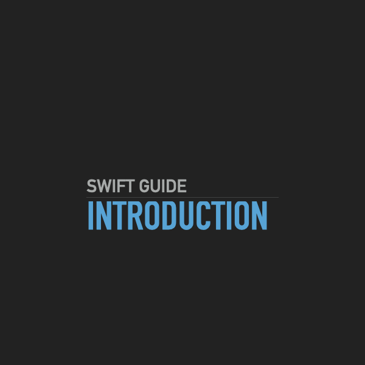

Apple introduced Swift back in 2014 for the development of iOS, iPadOS and macOS applications. Swift continues to evolve long after its release as new features are added.

***
## Abstract
The best way to start programming is to have fun, because writing code can become frustrating at times but even then it will be gratifying afterwards. That's all it takes on problem solving plus the accomplishment of making an application, better yet if it helps people.
            
Just like any other thing, the best way to improve is with practice and remember to keep up your progress as you will find how you improve and how much new things have you learnt on each new step.

***
## Swift
Swift by design is safer than objective-c, since times have changed since objective-c came around and what sugestions we may had then are actually safety rules now with Swift.
            
Swift's compiler is quite helpful when it comes to minimize undefined behavior, and it keeps certain familiarity with C family of languages, with modern syntax and performance while keeping the expressive part of objective-c that makes it easy to read.
            
Swift and its compiler are open source so anyone is free to follow its progress and get involved in the development as well.

***
## Hardware and Software
All the aplications in this guide are made with a mac runnning macOS Monterey (with M1 chip), other than that you will need to install Xcode (Apple's IDE) -from the Mac App Store- which comes with Swift compiler and other tools that you will use later on.
            
As Swift gets updated is possible that some examples no longer work, for reference this guide was written with Swift 5.6 and Xcode 13.

***
## Prerequisites
This guide was written for beginners who may not have any experience on programming whatsoever, having some experience will be helpful but is not necessary since you will cover most basic concepts and fundamentals of programming in general.
            
For more experienced developers, this guide can be helpful as introduction to Swift programming language, so feel free to skim through the contents and focus on what may not seem familiar
